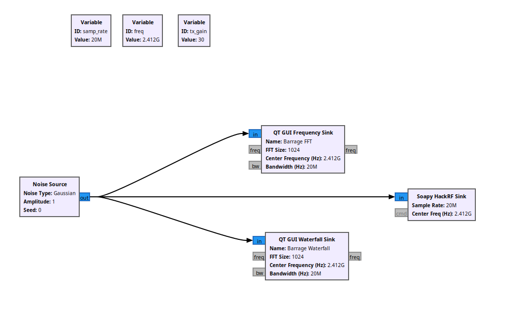
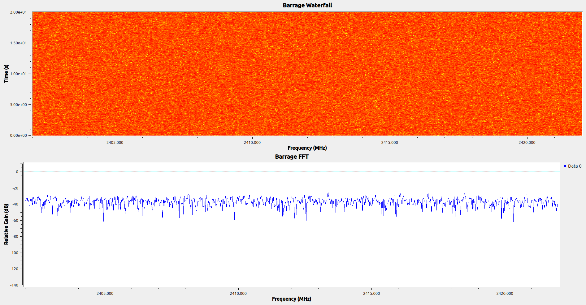

# Exploring HackRF SDR: A Jamming Tutorial into Signal Generation and Interference Effects

## About this Project

This repository serves as the supplementary material for our paper: **"Exploring HackRF SDR: A Jamming Tutorial into Signal Generation and Interference Effects"**. 

It demonstrates a proactive, software-defined radio (SDR) jamming attack targeting the 2.4 GHz Wi-Fi communication link (Downlink/Uplink) of a commercial UAV (Parrot Bebop 2). The attack generates continuous Gaussian noise to degrade the Signal-to-Noise Ratio (SNR), effectively disrupting telemetry, video feed, and command control.

## Hardware & Software Used

* **Hardware:** HackRF One + 2.4 GHz Antenna
* **OS:** Ubuntu 26.04
* GNU Radio Companion (v3.10.12.0)
  

## 1. GNU Radio Flowgraph
This is the flowgraph that generates the barrage jamming attack in GNU Radio Companion. It creates a Gaussian noise source, processes it through digital-to-analog conversion, and transmits it via the SoapySDR sink.

*(Fig 1: GNU Radio block architecture for the jamming transmission.)*

## 2. FFT & Waterfall
The impact of the jamming signal on the 2.4 GHz spectrum (Channel 1 - 2412 MHz). The noise floor is significantly raised, interfering with the legitimate UAV communication.

*(Fig 2: FFT and Waterfall plots showing the Gaussian noise flooding 20MHz of the bandwidth.)*

### 3. Video Demonstration

| No Jamming | Jamming Active |
| :---: | :---: |
| <video src="https://github.com/user-attachments/assets/9de74786-a06d-4e79-a076-965fdd2d9bb6" width="300"></video>   *Smooth video feed and responsive controls.* | <video src="https://github.com/user-attachments/assets/8dd5f081-b73b-4bb5-bd04-c3d159aaf2ff" width="300"></video>   *Severe video glitches and contreol lags.* |

